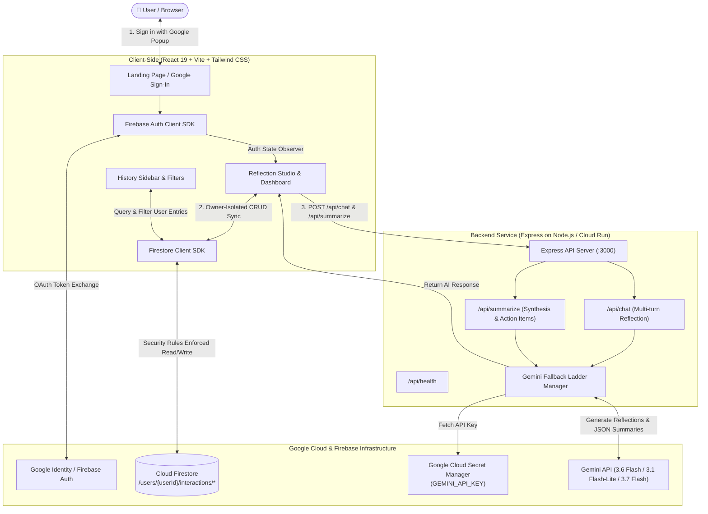
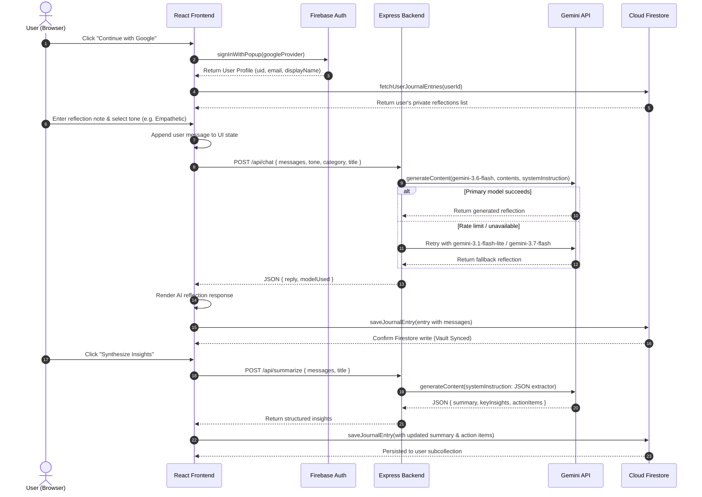

# ReflectAI - User-Authenticated AI Journal & Reflection App

ReflectAI is a secure, user-authenticated journaling and self-reflection web application built on **Google Cloud Run**, **Google Cloud Firestore**, **Firebase Authentication**, and the **Gemini 3.6 Flash API** via the `@google/genai` TypeScript SDK.

---

## 📐 Architecture & Data Flow Diagrams

### System Architecture Diagram


### End-to-End User Interaction Flow


---

## 💻 Local Development & Testing Guide

Follow these step-by-step instructions to run, test, and debug the repository locally.

### 1. Prerequisites
- **Node.js**: Version `20.x` or later.
- **npm** or **bun** / **yarn** package manager.
- **Gemini API Key**: Obtain a free API key from [Google AI Studio](https://aistudio.google.com/).
- **Firebase Project**: (Optional for local if using the provisioned config file `firebase-applet-config.json`).

### 2. Clone & Install Dependencies
```bash
# Clone the repository
git clone <YOUR_REPO_URL>
cd reflectai

# Install dependencies
npm install
```

### 3. Configure Environment Variables
Create a local `.env` file based on `.env.example`:
```bash
cp .env.example .env
```

Edit `.env` to supply your Gemini API key:
```env
GEMINI_API_KEY="AIzaSyYourActualGeminiAPIKeyHere"
APP_URL="http://localhost:3000"
PORT=3000
```

> **Note:** The Firebase configuration is read automatically from `firebase-applet-config.json`. Ensure this file exists in your project root with your Firebase project credentials.

### 4. Start Local Development Server
Run the unified Express + Vite development server:
```bash
npm run dev
```
Open your browser and navigate to:
```
http://localhost:3000
```

### 5. Validate TypeScript & Linter
Run static type-checking and lint checks:
```bash
npm run lint
```

### 6. Build and Test Production Bundle Locally
Verify that both frontend Vite assets and the backend CommonJS server bundle compile cleanly:
```bash
# Compile frontend and backend bundles
npm run build

# Start the production server locally
npm start
```

---

## 📂 Complete Project Repository Structure

```
.
├── .env.example                # Example environment variable declarations
├── .gitignore                  # Git ignore rules for node_modules, build artifacts, etc.
├── firebase-applet-config.json # Firebase project configuration & client keys
├── firestore.rules             # Deployed owner-bound Firestore security rules
├── index.html                  # HTML entry point with metadata and fonts
├── metadata.json               # Applet metadata, capabilities, and permissions
├── package.json                # Project dependencies, build, dev, and start scripts
├── README.md                   # Complete architectural guide, flow diagrams, and test suite
├── server.ts                   # Express server proxy with Gemini API fallback ladder
├── tsconfig.json               # TypeScript compiler configuration
├── vite.config.ts              # Vite bundler & Tailwind CSS configuration
└── src/
    ├── App.tsx                 # Primary app state coordinator, auth listener & routing
    ├── firebase.ts             # Firebase Auth & Firestore client SDK helpers (with payload hygiene)
    ├── index.css               # Global Tailwind CSS imports
    ├── main.tsx                # React DOM root entry point
    ├── types.ts                # Shared TypeScript interfaces, categories, moods, and payloads
    └── components/
        ├── LandingView.tsx     # Hero landing page & federated Google Sign-In prompt
        ├── Navbar.tsx          # Top navigation header with user profile pill & actions
        ├── ReflectionStudio.tsx# Multi-turn chat studio, AI synthesizer, tone/mood selectors
        ├── SecuritySpecModal.tsx# Interactive modal showing Threat Model & OWASP specs
        └── SidebarHistory.tsx  # Searchable, filterable vault of past reflection entries
```

---

## 🛡️ 1. Agentic Threat Model Summary (The 5 Threat Zones)

| Threat Zone | Identified Attack Vector / Risk | OWASP Classification | Implemented Countermeasure & Architecture |
| :--- | :--- | :--- | :--- |
| **1. Input Surfaces** | Malformed payloads, SQLi/NoSQLi, payload overflow | OWASP A03 / LLM02 | Strict Express JSON middleware, character length clamping (10k chars/turn), defensive null-safe destructuring. |
| **2. Planning & Reasoning** | Indirect prompt injection via journal notes | OWASP LLM01 | System instructions cleanly separate user data as unexecutable reflection input. |
| **3. Tool & API Execution** | Unauthorized API calls, token theft, SSRF | OWASP A01 / LLM05 | All Gemini calls run through server-side `/api/*` proxies with no dynamic code execution or client-exposed API keys. |
| **4. Memory & State** | Cross-user data leakage, unauthenticated database access | OWASP A01 / Broken Access Control | Firestore Security Rules strictly enforce owner isolation (`request.auth.uid == userId`) on `/users/{userId}/interactions/{id}`. |
| **5. Inter-System Communication** | Key exposure in client-side bundles | OWASP A07 / LLM06 | `GEMINI_API_KEY` stored exclusively in Google Cloud Secret Manager / server environment; federated Google Sign-In with zero password storage. |

---

## 🔒 2. Firestore Security Rules

Deploy the following owner-bound security rules to ensure private, isolated user collections:

```javascript
rules_version = '2';
service cloud.firestore {
  match /databases/{database}/documents {
    match /users/{userId} {
      allow read, write: if request.auth != null && request.auth.uid == userId;
    }
    match /users/{userId}/interactions/{interactionId} {
      allow read, write: if request.auth != null && request.auth.uid == userId;
    }
  }
}
```

---

## 🔑 3. Google Cloud Secret Manager & IAM Configuration

To protect your Gemini API key in production, configure Secret Manager and grant Cloud Run read permissions:

```bash
# 1. Create and populate the secret
gcloud secrets create GEMINI_API_KEY --replication-policy="automatic"
echo -n "YOUR_API_KEY" | gcloud secrets versions add GEMINI_API_KEY --data-file=-

# 2. Grant the Cloud Run service account access to read the secret
gcloud secrets add-iam-policy-binding GEMINI_API_KEY \
  --member="serviceAccount:YOUR_PROJECT_NUMBER-compute@developer.gserviceaccount.com" \
  --role="roles/secretmanager.secretAccessor"
```

---

## 🚀 4. Google Cloud Run Deployment Flow

### Prerequisites
- Google Cloud SDK (`gcloud` CLI) installed and logged in (`gcloud auth login`).
- Project set (`gcloud config set project YOUR_PROJECT_ID`).
- Required APIs enabled:
  ```bash
  gcloud services enable run.googleapis.com secretmanager.googleapis.com firestore.googleapis.com
  ```

### Build & Deploy
Deploy directly from source to Google Cloud Run:

```bash
gcloud run deploy reflectai \
  --source . \
  --region us-central1 \
  --allow-unauthenticated \
  --set-secrets="GEMINI_API_KEY=GEMINI_API_KEY:latest" \
  --port=3000
```

### Mandatory Campaign Verification Label
Apply the required label to register your Cloud Run service for automated challenge verification:

```bash
gcloud run services update reflectai \
  --update-labels=dev-tutorial=cloud-run-ai-challenge \
  --region us-central1
```

---

## 🧪 5. Comprehensive Functional Stability & Test Walkthrough

Below are step-by-step verification flows covering every user-facing interaction:

### Test Case 1: Unauthenticated Landing & Google Sign-In
1. Navigate to the application root URL (`http://localhost:3000`).
2. **Verify**: Landing page displays the secure zero-password banner, technical security highlights, and "Continue with Google" button.
3. Click "Continue with Google" to initiate federated popup authentication.
4. **Expected Result**: On successful authentication, the user profile is loaded and the app transitions into the private dashboard.

### Test Case 2: Multi-Turn Reflection Dialogue with Gemini 3.6 Flash
1. Inside the Reflection Studio, select a topic (e.g. *Daily Journal*) and tone (e.g. *Empathetic Guide* or *Socratic Questioner*).
2. Enter a reflection prompt or click one of the quick starter buttons (e.g., *"What was the most meaningful part of my day today?"*).
3. Press **Enter** or click **Send**.
4. **Verify**: A loading bubble indicates Gemini 3.6 Flash reflection processing.
5. **Expected Result**: Gemini returns an empathetic, formatted markdown response. The interaction is instantly synced to Firestore with a "Vault Synced" indicator.

### Test Case 3: AI Reflection Summarization & Action Items
1. After having at least one turn in the conversation, click the **"Synthesize Insights"** button in the studio toolbar.
2. **Verify**: A synthesis spinner runs against `/api/summarize`.
3. **Expected Result**: A top insights card appears containing a 2-4 sentence narrative distillation, key cognitive shifts/takeaways, and bulleted actionable next steps.

### Test Case 4: Vault Search, Filtering, and History Management
1. Click the **"New Reflection"** button to start a fresh reflection session.
2. Create a reflection in a different category (e.g., *Goal Setting*).
3. Search for a previous entry keyword in the search bar or click category filter pills (*Daily Journal*, *Goal Setting*, *All*).
4. **Expected Result**: The sidebar filters matching records instantly. Selecting any item loads its full multi-turn history from Firestore.

### Test Case 5: Isolated Deletion & Security Inspection
1. Hover over a reflection item in the sidebar history and click the trash can icon. Confirm the prompt.
2. **Expected Result**: The entry is deleted from the user's private Firestore collection and removed from view.
3. Click **"Security Architecture"** in the top navigation.
4. **Expected Result**: The modal displays the 5 Threat Zones, active Firestore security rules, and Gemini model fallback ladder.
